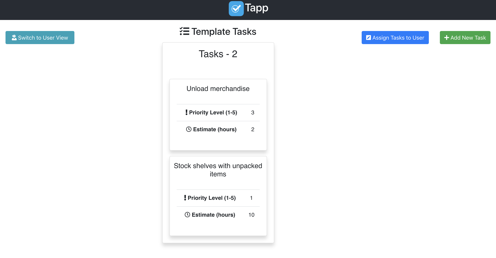
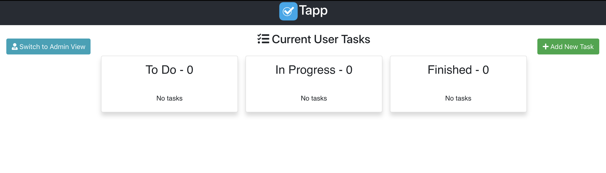

# Tapp

## Table of Contents

- [Application Tutorial](#application-tutorial)
  - [Next Steps](#next-steps)
  - [App Walkthrough](#app-walkthrough)
- [Folder Structure](#folder-structure)
- [Available Scripts](#available-scripts)
  - [npm start](#npm-start)
  - [npm test](#npm-test)
  - [npm run build](#npm-run-build)
  - [npm run eject](#npm-run-eject)

## Application Tutorial

Welcome to Tapp!

As it stands, the application currently has the following functionality:
- Displays a list of sorted pending tasks
  - Sorted by first status, second rank
- User has ability to track individual task status
- Extensible

The following functionality is ready to be implemented:
- Tracking time in each status after "Started" until "Finished"
- Recurring tasks duplicate based on recurrence frequency / schedule

Entered for the BYU Rollins Center for Entrepreneurship and Technology App Competition.

The app is written in React / Redux. The code has been thoroughly tested utilizing tools such as Jest and Enzyme.

Tasks are sorted throughout both the Admin and User Views by their respective rank weight. Rank weight is determined by a simple algorithm that weighs a task's priority and time estimate. The algorithm is as follows:

### `Rank Weight = ((priority * 100) / timeEstimate)`

The thinking behind this algorithm is that higher priority tasks should always be closer to the top of the list, thus the `* 100`. Super long tasks are not as prioritized as shorter tasks. As, in this system, it is most important to complete the highest number of high priority tasks possible in a given time period. Hence, the simple division of the time estimate allows for shorter tasks to have more precedence over longer tasks.

### Next Steps
- Refactor create / edit task modal form components (a lot of overlap)
- Fully implement Firebase so data persists
- Add authentication and authorization
- Implement more intuitive algorithm for calculating rank weight of task
- Ability to drag tasks between task columns

### App Walkthrough

This is the page you will be greeted with when first loading the app:



You will notice that the template tasks have two example tasks already created for you.
Clicking on one of the tasks will open a modal that displays the task's details, allowing you to edit certain pieces of information. This view can be seen below:


Clicking on the <br>
button will launch a modal similar to the task detail modal and will let you create a new task.

Clicking on the <br>
button will assign all current template tasks to the user, overriding any existing user tasks.

Clicking on the <br>
button will switch your context to a general user. Our users are ninjas, as they really kick butt.

Once you've clicked on the `Switch to User View` button you will be greeted with the following page:



Any tasks that are assigned to the user from the admin view, as well as any tasks a user decides to create, will show up here. Tasks are organized by their current status, which can be modified by the user in the task detail modal.

Clicking on the <br>
button will switch your view back to an admin user. Our admins are business people, as they are really professional.

## Folder Structure

The project has the following folder structure:

```
replenisher-task-app/
  README.md
  node_modules/
  package.json
  public/
    index.html
    favicon.ico
  src/
    __tests__/
    components/
      __tests__/
        App.test.js
      styles/
        App.css
      App.js
    images/
      logo.png
    styles/
      index.css
    index.js

```

For the project to build, **these files must exist with exact filenames**:

- `public/index.html` is the page template;
- `src/index.js` is the JavaScript entry point.

You can delete or rename the other files.

You may create subdirectories inside `src`. For faster rebuilds, only files inside `src` are processed by Webpack.<br>
You need to **put any JS and CSS files inside `src`**, otherwise Webpack won’t see them.

Only files inside `public` can be used from `public/index.html`.<br>
Read instructions below for using assets from JavaScript and HTML.

You can, however, create more top-level directories.<br>
They will not be included in the production build so you can use them for things like documentation.

## Available Scripts

In the project directory, you can run:

### `npm install`

This is required when the project is first cloned so the project can successfully run on your machine.

### `npm start`

Runs the app in the development mode.<br>
Open [http://localhost:3000](http://localhost:3000) to view it in the browser.

The page will reload if you make edits.<br>
You will also see any lint errors in the console.

### `npm test`

Launches the test runner in the interactive watch mode.<br>

### `npm run build`

Builds the app for production to the `build` folder.<br>
It correctly bundles React in production mode and optimizes the build for the best performance.

The build is minified and the filenames include the hashes.<br>
Your app is ready to be deployed!

### `npm run eject`

**Note: this is a one-way operation. Once you `eject`, you can’t go back!**

If you aren’t satisfied with the build tool and configuration choices, you can `eject` at any time. This command will remove the single build dependency from your project.

Instead, it will copy all the configuration files and the transitive dependencies (Webpack, Babel, ESLint, etc) right into your project so you have full control over them. All of the commands except `eject` will still work, but they will point to the copied scripts so you can tweak them. At this point you’re on your own.

You don’t have to ever use `eject`. The curated feature set is suitable for small and middle deployments, and you shouldn’t feel obligated to use this feature. However we understand that this tool wouldn’t be useful if you couldn’t customize it when you are ready for it.
